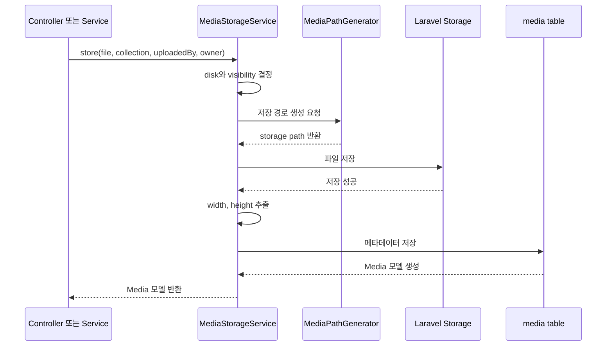

# 미디어 저장 구조

TipMarket의 미디어 계층은 업로드 이미지 파일을 공통 방식으로 저장하고 관리하기 위한 기반 코드다.

핵심 원칙은 단순하다.

| 구분 | 저장 위치 | 내용 |
| --- | --- | --- |
| 실제 이미지 파일 | Laravel filesystem disk | R2, public, local 같은 storage disk에 저장 |
| 파일 메타데이터 | `media` 테이블 | 경로, 용도, 업로드 사용자, 연결 대상, 크기, MIME, 상태 저장 |

현재 지원하는 용도는 프로필 이미지, 팁 썸네일, 질문 썸네일이다.

## 관련 파일

| 파일 | 역할 |
| --- | --- |
| `src/app/Enums/MediaCollection.php` | 미디어 용도 값을 `profile_avatar`, `tip_thumbnail`, `question_thumbnail`로 제한한다. |
| `src/app/Models/Media.php` | 업로드 파일 1개의 메타데이터와 상태 확인 메서드를 제공한다. |
| `src/app/Services/Media/MediaStorageService.php` | 파일 저장, DB 레코드 생성, 실제 파일 삭제를 담당한다. |
| `src/app/Services/Media/MediaPathGenerator.php` | 용도와 owner 기준으로 storage 내부 경로를 생성한다. |
| `src/config/media.php` | 저장 disk, 용도별 MIME, 용량, 공개 범위 정책을 정의한다. |
| `src/database/migrations/*_create_media_table.php` | `media` 테이블을 생성한다. |

## 저장 흐름

개발자는 컨트롤러나 도메인 서비스에서 `MediaStorageService::store()`만 호출한다. 실제 저장 경로 생성, Storage 저장, DB 메타데이터 생성은 서비스 내부에서 처리한다.



DB 저장 중 예외가 발생하면 `MediaStorageService`가 이미 저장한 파일을 삭제해 storage에 고아 파일이 남는 상황을 줄인다.

## 저장 경로

파일명은 원본 파일명을 쓰지 않는다. `Str::ulid()`와 업로드 파일 확장자를 조합해 충돌과 원본 파일명 노출을 줄인다.

| 용도 | owner 필요 여부 | 저장 경로 |
| --- | --- | --- |
| `profile_avatar` | 필수 | `profiles/{user_id}/avatar/{ulid}.{ext}` |
| `tip_thumbnail` | owner 있음 | `tips/{tip_id}/thumbnail/{ulid}.{ext}` |
| `tip_thumbnail` | owner 없음 | `media/temporary/tips/thumbnail/{ulid}.{ext}` |
| `question_thumbnail` | owner 있음 | `questions/{question_id}/thumbnail/{ulid}.{ext}` |
| `question_thumbnail` | owner 없음 | `media/temporary/questions/thumbnail/{ulid}.{ext}` |

`profile_avatar`는 반드시 owner가 필요하다. owner 없이 저장을 시도하면 `MediaPathGenerator`가 예외를 발생시킨다.

## media 테이블

`media` 테이블은 파일 자체가 아니라 파일을 찾고 관리하기 위한 정보를 저장한다.

| 컬럼 | 의미 |
| --- | --- |
| `disk` | 파일이 저장된 Laravel filesystem disk |
| `path` | disk 내부 파일 경로 |
| `collection` | 파일 용도 |
| `original_name` | 사용자가 업로드한 원본 파일명 |
| `mime_type`, `size`, `width`, `height` | 파일 정보 |
| `owner_type`, `owner_id` | 파일이 연결된 도메인 모델 |
| `uploaded_by_id` | 업로드한 사용자 |
| `status` | 연결 상태 |
| `visibility` | 공개 범위 |
| `metadata` | 추가 메타데이터 |

상태 값은 다음 기준으로 사용한다.

| 상태 | 의미 |
| --- | --- |
| `temporary` | 아직 글, 질문, 사용자 같은 owner에 연결되지 않은 임시 파일 |
| `attached` | owner 모델에 연결된 파일 |
| `orphaned` | owner 삭제 또는 이미지 교체로 정리 대기 중인 파일 |

## 개발자 사용법

### 프로필 이미지처럼 owner가 이미 있는 경우

컨트롤러는 파일을 직접 `Storage`에 저장하지 않는다. `FormRequest`에서 검증한 파일을 `MediaStorageService`에 넘긴다.

```php
use App\Enums\MediaCollection;
use App\Services\Media\MediaStorageService;

public function updateAvatar(UpdateAvatarRequest $request, MediaStorageService $mediaStorage)
{
    $media = $mediaStorage->store(
        file: $request->file('avatar'),
        collection: MediaCollection::ProfileAvatar,
        uploadedBy: $request->user(),
        owner: $request->user(),
    );

    return back();
}
```

이 경우 생성된 `Media`는 `attached` 상태로 저장된다.

### 글 저장 전에 썸네일을 먼저 올리는 경우

팁이나 질문이 아직 생성되지 않았다면 owner 없이 임시 파일로 저장한다.

```php
$media = $mediaStorage->store(
    file: $request->file('thumbnail'),
    collection: MediaCollection::TipThumbnail,
    uploadedBy: $request->user(),
);
```

owner 없이 저장된 파일은 `temporary` 상태가 된다. 이후 글이나 질문 모델이 생성되면 별도 연결 로직에서 owner 정보를 채우고 `attached`로 바꾼다.

```php
$media->update([
    'owner_type' => $tip->getMorphClass(),
    'owner_id' => $tip->getKey(),
    'status' => \App\Models\Media::STATUS_ATTACHED,
]);
```

### 파일 삭제

파일 삭제도 `Storage`와 `Media` 모델을 각각 직접 다루지 않고 `MediaStorageService::delete()`를 사용한다.

```php
$mediaStorage->delete($media);
```

삭제 순서는 다음과 같다.

1. storage disk에서 실제 파일 삭제
2. 파일 삭제 실패 시 예외 발생
3. 파일 삭제 성공 시 `media` 레코드 soft delete

## 검증 책임

`src/config/media.php`에는 collection별 `max_size`, `mimes`, `visibility` 정책이 정의되어 있다. 다만 현재 `MediaStorageService`는 파일 검증을 직접 수행하지 않는다.

따라서 컨트롤러 진입 전 `FormRequest`에서 용도에 맞게 검증해야 한다.

```php
public function rules(): array
{
    return [
        'avatar' => [
            'required',
            'image',
            'mimetypes:image/jpeg,image/png,image/webp',
            'max:2048',
        ],
    ];
}
```

## 현재 연결된 흐름

현재 구현은 저장 기반 계층 위에 프로필 이미지 교체 흐름까지 연결되어 있다.

| 구현된 흐름 | 설명 |
| --- | --- |
| 프로필 이미지 저장 | 설정 화면에서 `profile_avatar` 파일을 사용자 owner에 `attached` 상태로 저장 |
| 프로필 이미지 교체 | 새 파일 연결 후 이전 프로필 이미지를 `orphaned` 처리 |
| 프로필 이미지 삭제 | 저장된 프로필 이미지 파일을 삭제하고 `media` 레코드를 soft delete 처리 |
| 프로필 이미지 테스트 | 업로드 성공, 선택 취소, 삭제, 교체 시 이전 이미지 `orphaned` 처리, 이미지 검증 실패 확인 |

## 아직 없는 흐름

다음 흐름은 기능 구현 단계에서 별도 서비스나 액션으로 추가한다.

| 필요 흐름 | 설명 |
| --- | --- |
| 임시 파일 attach | `temporary` 파일을 owner 모델에 연결 |
| 임시 파일 정리 | 오래된 `temporary` 파일을 주기적으로 삭제 |
| 비공개 파일 접근 제어 | signed URL 또는 권한 확인 추가 |
| 삭제 실패 테스트 | storage 삭제 실패와 DB 상태 보존 검증 |
