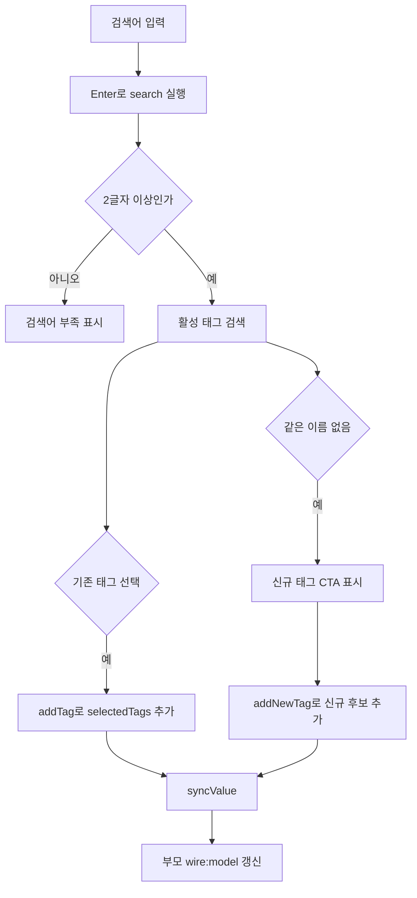
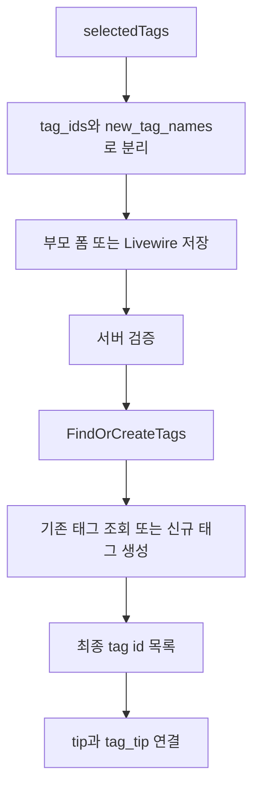

# 태그 선택기

태그 선택기는 태그 검색, 선택, 신규 태그 후보 추가, 제거, 폼 전송 값을 처리하는 재사용 Livewire UI다.

컴포넌트의 책임은 입력 UI와 선택 상태 관리까지다. 태그를 DB에 저장하거나 `tips`와 연결하는 처리는 부모 폼, 부모 Livewire 컴포넌트, 저장 Action에서 수행한다.

## 빠른 사용

일반 Blade 폼에서는 컴포넌트 래퍼를 사용한다.

```blade
<x-tags.selector />
```

옵션이 필요한 경우에는 아래처럼 넘긴다.

```blade
<x-tags.selector
    label="관련 태그"
    placeholder="태그 이름을 입력하세요"
    name="tag_ids"
    :max-count="5"
/>
```

Livewire 부모 컴포넌트에서는 `wire:model`로 선택값을 동기화한다.

```blade
<livewire:tags.tag-selector wire:model="tagIds" />
```

부모 컴포넌트에는 같은 이름의 public property를 둔다.

```php
public array $tagIds = [];
```

## 태그명 모드

AI 생성 모달처럼 기존 태그와 신규 태그 후보를 모두 이름 기준으로 넘겨야 하면 `value-mode="names"`를 사용한다.

```blade
<livewire:tags.tag-selector
    wire:model="tagNames"
    value-mode="names"
/>
```

이 모드에서 부모로 넘어가는 값은 태그명 배열이다.

```php
['청소', '욕실정리']
```

## 옵션

| 옵션 | 기본값 | 설명 |
| --- | --- | --- |
| `label` | `태그` | 태그 선택기 상단 라벨 |
| `placeholder` | `태그 이름 검색...` | 검색 입력창 안내 문구 |
| `name` | `tag_ids` | 기존 태그 hidden input 이름 |
| `maxCount` | `null` | 최대 선택 개수. `null`이면 제한 없음 |
| `selected` | `[]` | 수정 화면에서 미리 선택할 태그 목록 |
| `valueMode` | `ids` | 부모 `wire:model` 값 형식. `ids` 또는 `names` |

## 전송 값

기존 태그는 `tag_ids[]`로 전송된다.

```html
<input type="hidden" name="tag_ids[]" value="1">
<input type="hidden" name="tag_ids[]" value="2">
```

신규 태그 후보는 `new_tag_names[]`로 전송된다.

```html
<input type="hidden" name="new_tag_names[]" value="욕실정리">
```

컨트롤러나 저장 Action에서는 두 값을 함께 처리한다.

```php
$tagIds = $request->input('tag_ids', []);
$newTagNames = $request->input('new_tag_names', []);
```

## 동작 로직

| 단계 | 처리 위치 | 설명 |
| --- | --- | --- |
| 초기화 | `mount()` | `selected` 값을 `selectedTags` 배열로 정규화 |
| 검색 | `search()` + `TagSearchService` | 2글자 이상 검색어로 활성 태그 조회 |
| 기존 태그 추가 | `addTag()` | 최대 개수, 중복, 활성 태그 여부를 확인한 뒤 추가 |
| 신규 후보 추가 | `addNewTag()` | DB 저장 없이 `isNew: true` 항목으로 선택 목록에 추가 |
| 제거 | `removeTag()` | 선택 목록에서 제거 |
| 부모 동기화 | `syncValue()` | `ids` 모드는 기존 태그 id 배열, `names` 모드는 태그명 배열 전달 |
| 저장 | `FindOrCreateTags` | 기존 id와 신규 이름을 최종 태그 id 목록으로 변환 |

## 검색과 선택 흐름



## 저장 흐름



## 정규화 규칙

신규 태그 후보와 `names` 모드의 태그명은 선택기 내부에서 아래 규칙으로 정리된다.

- 앞뒤 공백 제거
- 앞쪽 `#` 제거
- 모든 공백 문자 제거
- 2글자 미만 태그명 차단
- 이미 선택된 태그명과 같은 이름 차단
- 활성 태그 중 같은 이름이 있으면 신규 후보 대신 기존 태그 선택 유도

이 처리는 UI 단계의 1차 방어선이다. 최종 저장 전에는 서버에서 길이, 중복, 활성 태그 여부를 다시 검증해야 한다.

## 선택 개수 제한

기본값은 제한 없음이다. 사용처에서 제한이 필요할 때만 `max-count`를 넘긴다.

```blade
<livewire:tags.tag-selector
    wire:model="tagIds"
    :max-count="5"
/>
```

부모 검증에도 같은 제한을 둔다.

```php
$this->validate([
    'tagIds' => ['array', 'max:5'],
    'tagIds.*' => ['integer', 'exists:tags,id'],
]);
```

신규 태그 후보도 선택 개수에 포함된다.

## 수정 화면

기존 글 수정 화면처럼 이미 연결된 태그가 있다면 `selected`에 태그 목록을 넘긴다.

```blade
<x-tags.selector
    :selected="$tip->tags"
/>
```

## 내부 구조

| 경로 | 역할 |
| --- | --- |
| `resources/views/components/tags/selector.blade.php` | `<x-tags.selector />` 템플릿 입구 |
| `app/Livewire/Tags/TagSelector.php` | 검색어, 선택 태그 상태, `#[Modelable]` 값 동기화 |
| `resources/views/livewire/tags/tag-selector.blade.php` | 실제 태그 선택기 화면 |
| `app/Services/Tags/TagSearchService.php` | 활성 태그 검색 쿼리 |
| `app/Actions/Tags/FindOrCreateTags.php` | 기존 태그 id와 신규 태그명을 최종 태그 id 목록으로 변환 |

## 분석 순서

```text
resources/views/components/tags/selector.blade.php
-> app/Livewire/Tags/TagSelector.php
-> resources/views/livewire/tags/tag-selector.blade.php
-> app/Services/Tags/TagSearchService.php
-> app/Actions/Tags/FindOrCreateTags.php
```
