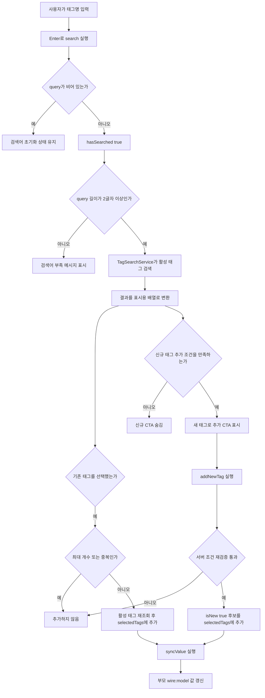

# 태그 선택기

태그 선택기는 태그 검색, 선택, 신규 태그 후보 추가, 제거, hidden input 생성을 처리하는 재사용 UI 템플릿이다.

현재 화면에서는 Livewire 컴포넌트로 동작하고, 태그 검색 쿼리는 서비스 클래스로 분리해 재사용한다. 태그 선택기는 저장을 직접 처리하지 않고, 부모 폼이나 부모 Livewire 컴포넌트에 선택된 태그 id 목록 또는 태그명 목록을 넘기는 입력 부품 역할만 한다.

## 동작 로직 요약

태그 선택기는 검색, 선택 목록 관리, 부모 값 동기화까지만 책임진다. 태그를 DB에 저장하거나 `tips`와 연결하는 처리는 부모 폼, 부모 Livewire 컴포넌트, 저장 Action에서 수행한다.

1. 컴포넌트가 생성되면 `selected` 값을 내부 표준 배열인 `selectedTags`로 정규화한다.
2. 사용자가 검색어를 입력하고 Enter를 누르면 `search()`가 `query`를 정리하고 검색 결과 드롭다운을 연다.
3. `TagSearchService`는 2글자 이상 검색어에 대해서만 활성 태그를 조회한다.
4. 기존 태그를 선택하면 `addTag()`가 최대 개수, 중복 선택, 활성 태그 여부를 다시 확인한 뒤 `selectedTags`에 추가한다.
5. 검색 결과에 같은 이름이 없고 신규 생성 조건을 만족하면 `addNewTag()`가 DB 저장 없이 신규 태그 후보를 `selectedTags`에 추가한다.
6. 태그를 추가하거나 제거할 때마다 `syncValue()`가 부모 `wire:model` 값을 갱신한다.
7. 일반 폼 제출 시 기존 태그는 `tag_ids[]`, 신규 태그 후보는 `new_tag_names[]` hidden input으로 전송된다.

## 검색과 선택 흐름



## 폼 제출과 저장 흐름

```mermaid
flowchart TD
    A[selectedTags] --> B{기존 태그인가}
    B -- 예 --> C[tag_ids[] hidden input 생성]
    B -- 아니오 --> D[new_tag_names[] hidden input 생성]
    C --> E[부모 폼 또는 부모 Livewire 저장 요청]
    D --> E
    E --> F[서버 검증]
    F --> G[FindOrCreateTags 실행]
    G --> H[기존 tagIds 정수 배열 정리]
    G --> I[신규 tagNames 정규화]
    I --> J{2글자 이상 50글자 이하인가}
    J -- 아니오 --> K[해당 태그명 제외]
    J -- 예 --> L[name 기준 기존 태그 조회]
    L --> M{기존 태그가 있는가}
    M -- 예 --> N[기존 태그 id 사용]
    M -- 아니오 --> O[새 Tag 생성 후 id 사용]
    H --> P[최종 tag id 목록 병합 및 중복 제거]
    N --> P
    O --> P
    P --> Q[tip과 tag_tip 연결]
```

## 일반 Blade 폼 사용

```blade
<x-tags.selector />
```

위 코드를 폼 안에 넣으면 태그 선택기를 바로 사용할 수 있다.

## 옵션 사용

```blade
<x-tags.selector
    label="관련 태그"
    placeholder="태그 이름을 입력하세요"
    name="tag_ids"
    :max-count="5"
/>
```

## 옵션 설명

| 옵션 | 기본값 | 설명 |
| --- | --- | --- |
| `label` | `태그` | 태그 선택기 상단에 표시할 라벨 |
| `placeholder` | `태그 이름 검색...` | 검색 입력창 안내 문구 |
| `name` | `tag_ids` | 폼 제출 시 사용할 input 이름 |
| `maxCount` | `null` | 선택 가능한 최대 태그 개수. `null`이면 제한 없음 |
| `selected` | `[]` | 수정 화면에서 미리 선택해 둘 태그 목록 |
| `valueMode` | `ids` | `wire:model`로 부모에 넘길 값 형식. `ids`는 기존 태그 id 배열, `names`는 기존/신규 태그명 배열 |

## 수정 화면에서 기존 태그 전달

```blade
<x-tags.selector
    :selected="$tip->tags"
/>
```

기존 글 수정 화면처럼 이미 연결된 태그가 있다면 `selected`에 태그 목록을 넘긴다.

## 폼 전송 값

선택된 기존 태그는 hidden input으로 렌더링된다.

```html
<input type="hidden" name="tag_ids[]" value="1">
<input type="hidden" name="tag_ids[]" value="2">
```

컨트롤러에서는 아래처럼 받을 수 있다.

```php
$tagIds = $request->input('tag_ids', []);
```

## 신규 태그 후보 전송

검색 결과에 없는 태그명은 선택 목록에 신규 태그 후보로 추가할 수 있다. 이때 태그 선택기는 DB에 바로 저장하지 않고, `new_tag_names[]` hidden input만 만든다.

```html
<input type="hidden" name="new_tag_names[]" value="욕실정리">
```

저장 로직은 기존 태그 id와 신규 태그명을 함께 검증한 뒤 실제 태그를 찾거나 생성해야 한다.

```php
$tagIds = $request->input('tag_ids', []);
$newTagNames = $request->input('new_tag_names', []);
```

현재 저장 흐름에서는 `App\Actions\Tags\FindOrCreateTags`가 기존 `tagIds`와 신규 `tagNames`를 합쳐 실제 연결 가능한 태그 id 목록으로 정리한다.

## Livewire 부모 컴포넌트에서 사용

Livewire 화면에서는 부모 컴포넌트가 태그 배열을 소유하고, 태그 선택기는 `wire:model`로 그 값만 동기화한다. 기본 `valueMode`는 `ids`라서 기존 태그 id 배열만 부모에 전달한다.

```blade
<livewire:tags.tag-selector wire:model="tagIds" />
```

부모 Livewire 컴포넌트에는 같은 이름의 public property를 둔다.

```php
public array $tagIds = [];
```

검증 예시는 아래와 같다.

```php
$this->validate([
    'tagIds' => ['array'],
    'tagIds.*' => ['integer', 'exists:tags,id'],
]);
```

## 태그명 모드 사용

AI 생성 모달처럼 기존 태그와 신규 태그 후보를 모두 이름 기준으로 넘겨야 하는 화면에서는 `value-mode="names"`를 사용한다.

```blade
<livewire:tags.tag-selector
    wire:model="tagNames"
    value-mode="names"
/>
```

부모 Livewire 컴포넌트에는 태그명 배열을 둔다.

```php
public array $tagNames = [];
```

이 모드에서 부모로 동기화되는 값은 선택된 기존/신규 태그의 이름 배열이다.

```php
['청소', '욕실정리']
```

태그 선택기는 태그명을 정규화해 중복을 제거하지만, 저장 직전 검증은 부모 컴포넌트나 Action에서 다시 수행해야 한다.

## 선택 개수 제한

기본값은 제한 없음이다. 사용처에서 제한이 필요할 때만 `max-count`를 넘긴다.

```blade
<livewire:tags.tag-selector
    wire:model="tagIds"
    :max-count="5"
/>
```

이 경우 부모 Livewire 검증에도 같은 제한을 둔다.

```php
$this->validate([
    'tagIds' => ['array', 'max:5'],
    'tagIds.*' => ['integer', 'exists:tags,id'],
]);
```

숫자를 한 곳에서 관리하려면 부모 컴포넌트에 프로퍼티를 둔다.

```php
public int $maxTagCount = 5;
```

```blade
<livewire:tags.tag-selector
    wire:model="tagIds"
    :max-count="$maxTagCount"
/>
```

```php
$this->validate([
    'tagIds' => ['array', 'max:'.$this->maxTagCount],
    'tagIds.*' => ['integer', 'exists:tags,id'],
]);
```

UI 제한과 서버 검증은 함께 적용한다. UI만 제한하면 요청 조작으로 우회할 수 있고, 서버 검증만 두면 사용자가 제한을 늦게 알게 된다.

신규 태그 후보도 선택 개수에 포함된다.

## 태그명 정규화 규칙

신규 태그 후보와 `names` 모드의 태그명은 선택기 내부에서 아래 규칙으로 정리된다.

- 앞뒤 공백 제거
- 앞쪽 `#` 제거
- 모든 공백 문자 제거
- 2글자 미만 태그명 차단
- 이미 선택된 태그명과 같은 이름 차단
- 활성 태그 중 같은 이름이 있으면 신규 후보 대신 기존 태그 선택 유도

이 정규화는 사용자 경험을 위한 1차 방어선이다. 최종 저장 로직에서는 길이, 중복, 활성 태그 여부를 다시 검증해야 한다.

## 내부 구조

| 경로 | 역할 |
| --- | --- |
| `resources/views/components/tags/selector.blade.php` | `<x-tags.selector />` 템플릿 입구 |
| `app/Livewire/Tags/TagSelector.php` | 검색어, 검색 상태, 기존/신규 선택 태그 상태 관리, `#[Modelable]` 값 동기화 |
| `resources/views/livewire/tags/tag-selector.blade.php` | 실제 태그 선택기 화면 |
| `app/Services/Tags/TagSearchService.php` | 태그 검색 쿼리 |
| `app/Actions/Tags/FindOrCreateTags.php` | 저장 시 기존 태그 id와 신규 태그명을 최종 태그 id 목록으로 변환 |

## 분석 순서

태그 선택기 구조를 분석할 때는 아래 순서로 본다.

```text
resources/views/components/tags/selector.blade.php
-> app/Livewire/Tags/TagSelector.php
-> resources/views/livewire/tags/tag-selector.blade.php
-> app/Services/Tags/TagSearchService.php
```
