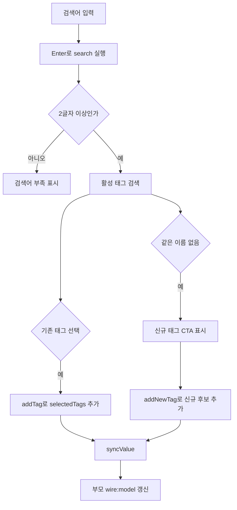
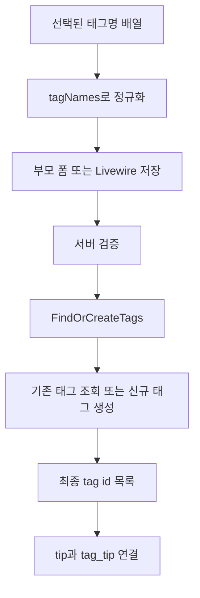

# 태그 선택기

태그 선택기는 태그 검색, 선택, 신규 태그 후보 추가, 제거, 폼 전송 값을 처리하는 재사용 Livewire UI다.

컴포넌트의 책임은 입력 UI와 선택 상태 관리까지다. 태그를 DB에 저장하거나 `tips`와 연결하는 처리는 부모 폼, 부모 Livewire 컴포넌트, 저장 Action에서 수행한다.

## 빠른 사용

일반 Blade 폼에서는 컴포넌트 래퍼를 사용한다.

```blade
<x-tags.selector />
```

옵션이 필요한 경우에는 아래처럼 넘긴다.

```blade
<x-tags.selector
    label="관련 태그"
    placeholder="태그 이름을 입력하세요"
    name="tag_names"
    :max-count="5"
/>
```

Livewire 부모 컴포넌트에서는 `wire:model`로 선택값을 동기화한다.

```blade
<livewire:tags.tag-selector wire:model="tagNames" />
```

부모 컴포넌트에는 같은 이름의 public property를 둔다.

```php
public array $tagNames = [];
```

부모로 넘어가는 값은 기존/신규 구분 없는 태그명 배열이다.

```php
['청소', '욕실정리']
```

## 옵션

| 옵션 | 기본값 | 설명 |
| --- | --- | --- |
| `label` | `태그` | 태그 선택기 상단 라벨 |
| `placeholder` | `태그 이름 검색...` | 검색 입력창 안내 문구 |
| `name` | `tag_names` | 태그명 hidden input 이름 |
| `maxCount` | `null` | 최대 선택 개수. `null`이면 제한 없음 |
| `selected` | `[]` | 수정 화면에서 미리 선택할 태그 목록 |
| `allowCreate` | `true` | 신규 태그 후보 추가 허용 여부. 검색 필터에서는 `false`로 둔다 |
| `variant` | `default` | 기본 입력 UI와 검색 필터용 `compact` UI 구분 |

## 값 전달

일반 Blade 폼에서는 기존 태그와 신규 태그 후보가 모두 태그명 hidden input으로 전송된다.

```html
<input type="hidden" name="tag_names[]" value="청소">
<input type="hidden" name="tag_names[]" value="욕실정리">
```

Livewire 부모 컴포넌트에서도 같은 태그명 배열이 부모 property로 바로 동기화된다.

저장 데이터로 정리할 때는 `tagNames`를 기준으로 태그를 찾거나 생성하고, DB 연결 직전에만 id 배열로 변환한다. `TipDraftData`는 입력 배열에서 `tag_names`, `tagNames`, `tags` 키를 받아 내부의 `tagNames`로 정규화한다.

## 부모 Livewire 사용 흐름

부모 Livewire 컴포넌트는 태그 선택기의 내부 상태를 직접 다루지 않는다. 부모는 `public array $tagNames = []`만 선언하고, Blade에서 `wire:model="tagNames"`로 연결한다.

```php
public array $tagNames = [];
```

```blade
<livewire:tags.tag-selector wire:model="tagNames" />
```

태그 선택기 내부에서는 `#[Modelable] public array $value`를 사용해 선택된 태그명을 부모 property로 동기화한다. 부모로 넘어오는 값은 아래처럼 기존 태그와 신규 태그 후보를 구분하지 않는 문자열 배열이다.

```php
['청소', '욕실정리']
```

부모가 해야 하는 일은 사용 목적에 따라 달라진다.

| 사용 목적 | 부모 책임 |
| --- | --- |
| 생성/저장 폼 | `tagNames`를 검증하고 정규화한 뒤 저장 Action에 넘긴다 |
| 검색/필터 폼 | `tagNames`를 필터 배열에 넣고 목록 쿼리에 넘긴다 |
| 수정 폼 | 기존 연결 태그를 `selected`로 넘기고, 저장 시 최종 태그명 배열을 다시 처리한다 |

### AI 팁 생성 모달

AI 생성 모달은 태그 선택값을 AI 프롬프트의 참고 태그와 저장 시 필수 포함 태그로 사용한다.

```blade
<livewire:tags.tag-selector
    :key="'ai-tip-tag-selector-'.$tagSelectorKey"
    wire:model="tagNames"
/>
```

부모 컴포넌트는 `tagNames`를 검증한다.

```php
protected function rules(): array
{
    return [
        'tagNames' => ['array', 'max:20'],
        'tagNames.*' => ['string', 'min:2', 'max:50'],
    ];
}
```

생성 액션에서는 검증된 태그명을 정규화해 프롬프트 빌더와 생성 서비스에 넘긴다.

```php
$requiredTagNames = $this->normalizeTagNames($validated['tagNames'] ?? []);

$prompt = $buildPrompt(
    prompt: $validated['prompt'] ?? '',
    count: $validated['count'],
    categoryName: $categoryName,
    tagNames: $requiredTagNames,
);

$drafts = $generateTips(
    prompt: $prompt,
    categoryId: $validated['categoryId'],
    requiredTagNames: $requiredTagNames,
);
```

현재 구현 파일은 `src/app/Livewire/Console/Tips/AiCreateTip.php`와 `src/resources/views/livewire/console/tips/ai-create-tip.blade.php`다.

### 관리자 팁 목록 필터

관리자 팁 목록에서는 태그 선택기를 저장 입력이 아니라 검색 필터로 사용한다. 이 경우 신규 태그 후보를 만들면 안 되므로 `allow-create`를 `false`로 둔다.

```blade
<livewire:tags.tag-selector
    wire:model="tagNames"
    label=""
    placeholder="태그 이름 검색"
    name="tag_names"
    :allow-create="false"
    variant="compact"
/>
```

부모 trait은 선택된 태그명 배열을 검색 조건으로 보관한다.

```php
public array $tagNames = [];
```

목록 조회 전에는 필터 배열의 `tag_names`로 변환한다.

```php
protected function tipListFilters(): array
{
    return [
        'tag_names' => $this->tagNames,
    ];
}
```

목록 컴포넌트는 이 필터를 쿼리 객체에 넘긴다.

```php
TipListQuery::make()->paginate($this->tipListFilters(), 15);
```

현재 구현 파일은 `src/app/Livewire/Console/Tips/TipManagementList.php`, `src/app/Livewire/Concerns/ManagesTipListFilters.php`, `src/resources/views/livewire/console/tips/tip-management-list.blade.php`다.

## 동작 로직

| 단계 | 처리 위치 | 설명 |
| --- | --- | --- |
| 초기화 | `mount()` | `selected` 값을 `selectedTags` 배열로 정규화 |
| 검색 | `search()` + `TagSearchService` | 2글자 이상 검색어로 활성 태그 조회 |
| 기존 태그 추가 | `addTag()` | 최대 개수, 중복, 활성 태그 여부를 확인한 뒤 추가 |
| 신규 후보 추가 | `addNewTag()` | DB 저장 없이 `isNew: true` 항목으로 선택 목록에 추가 |
| 제거 | `removeTag()` | 선택 목록에서 제거 |
| 부모 동기화 | `syncValue()` | 기존/신규 구분 없이 태그명 배열 전달 |
| 저장 | `FindOrCreateTags` | 태그명을 최종 태그 id 목록으로 변환 |

## 검색과 선택 흐름


```mermaid
flowchart TD
    A["검색어 입력"] --> B["Enter로 search 실행"]
    B --> C{"2글자 이상인가"}
    C -- "아니오" --> D["검색어 부족 표시"]
    C -- "예" --> E["활성 태그 검색"]
    E --> F{"기존 태그 선택"}
    F -- "예" --> G["addTag로 selectedTags 추가"]
    E --> H{"같은 이름 없음"}
    H -- "예" --> I["신규 태그 CTA 표시"]
    I --> J["addNewTag로 신규 후보 추가"]
    G --> K[syncValue]
    J --> K
    K --> L["부모 wire:model 갱신"]
```

## 저장 흐름


```mermaid
flowchart TD
    A["선택된 태그명 배열"] --> B["tagNames로 정규화"]
    B --> C["부모 폼 또는 Livewire 저장"]
    C --> D["서버 검증"]
    D --> E["FindOrCreateTags"]
    E --> F["기존 태그 조회 또는 신규 태그 생성"]
    F --> G["최종 tag id 목록"]
    G --> H["tip과 tag_tip 연결"]
```

## 정규화 규칙

신규 태그 후보와 선택된 태그명은 선택기 내부에서 아래 규칙으로 정리된다.

- 앞뒤 공백 제거
- 앞쪽 `#` 제거
- 모든 공백 문자 제거
- 2글자 미만 태그명 차단
- 이미 선택된 태그명과 같은 이름 차단
- 활성 태그 중 같은 이름이 있으면 신규 후보 대신 기존 태그 선택 유도

이 처리는 UI 단계의 1차 방어선이다. 최종 저장 전에는 서버에서 길이, 중복, 활성 태그 여부를 다시 검증해야 한다.

## 선택 개수 제한

기본값은 제한 없음이다. 사용처에서 제한이 필요할 때만 `max-count`를 넘긴다.

```blade
<livewire:tags.tag-selector
    wire:model="tagNames"
    :max-count="5"
/>
```

부모 검증에도 같은 제한을 둔다.

```php
$this->validate([
    'tagNames' => ['array', 'max:5'],
    'tagNames.*' => ['string', 'min:2', 'max:50'],
]);
```

신규 태그 후보도 선택 개수에 포함된다.

## 수정 화면

기존 글 수정 화면처럼 이미 연결된 태그가 있다면 `selected`에 태그 목록을 넘긴다.

```blade
<x-tags.selector
    :selected="$tip->tags"
/>
```

## 내부 구조

| 경로 | 역할 |
| --- | --- |
| `resources/views/components/tags/selector.blade.php` | `<x-tags.selector />` 템플릿 입구 |
| `app/Livewire/Tags/TagSelector.php` | 검색어, 선택 태그 상태, `#[Modelable]` 값 동기화 |
| `resources/views/livewire/tags/tag-selector.blade.php` | 실제 태그 선택기 화면 |
| `app/Services/Tags/TagSearchService.php` | 활성 태그 검색 쿼리 |
| `app/Actions/Tags/FindOrCreateTags.php` | 태그명을 최종 태그 id 목록으로 변환 |

## 분석 순서

```text
resources/views/components/tags/selector.blade.php
-> app/Livewire/Tags/TagSelector.php
-> resources/views/livewire/tags/tag-selector.blade.php
-> app/Services/Tags/TagSearchService.php
-> app/Actions/Tags/FindOrCreateTags.php
```
